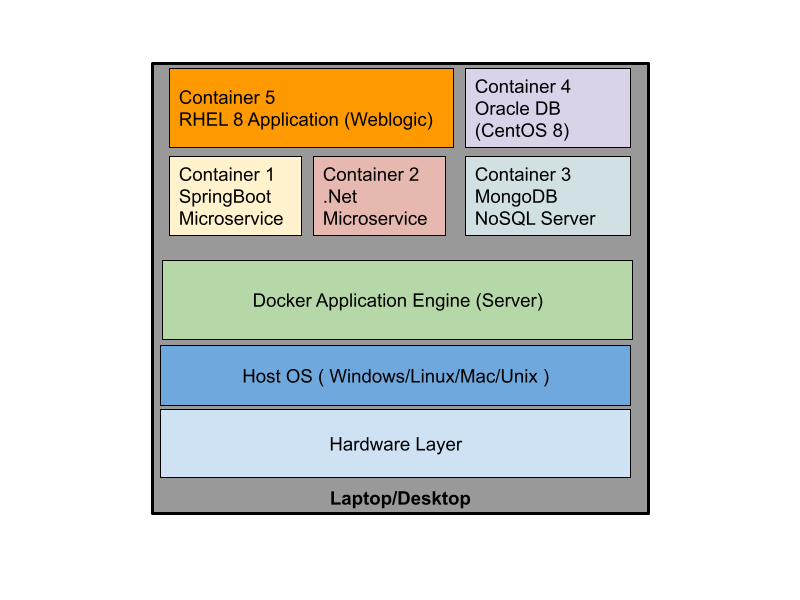

### Adding rps user to sudoers file from terminal

Edit /etc/sudoers and add rps user as shown below
```
su -
vim /etc/sudoers
```
You need to add the below line just below line no 100
<pre>
rps ALL=(ALL) ALL
</pre>

Also you need to uncomment line no 111 as shown below
<pre>
%wheel  ALL=(ALL) NOPASSWD: ALL
</pre>

You need to save and exit by pressing Ctrl

### Installing git in CentOS 
```
sudo yum install -y git
```

### What is Hypervisor?
- a general term that refers to virtualization
- virtualization technology
- virtualization technology let's you boot many Operation Systems side by side in the same system simultaneously
- software + software solution
- Processor
  AMD - whichever processor supports AMD-V feature, they all support Virtualization
  Intel - whichever processor supports VT-X feature, they all support Virtualization
- Virtualization technology is heavy-weight
    - become every Virtual machine(aka Guest OS) required dedicated hardware resources
        - CPU
        - RAM
        - Storage, etc
- revolutioned the IT industry
- this technology allows Server consolidation
- 1 Server/workstation can consolidate many servers
- Type 1 Hypervisor and Type 2 Hypervisor
- Type 1 - Bare Metal Hypervisor - used in workstations/Servers ( They don't need an Operating System )
- Type 2 - Used in Laptop/Desktops ( They need a Host OS - Hypervisor is installed on top of Host OS )
- Virtual Machine hosts a fully functional Operating System

Processor with 512 Physical Cores
256 TB RAM
500 TB Storage

How many Virtual Machine(Guest OS) you can deploy and run them at the same time?

A single Virtual Machine with 512 Cores - assuming 1 Physical CPU core assigned per VM

Hyperthreading (AMD equivalent is called SMT )
	- each processor supports two virtual cores per physical core
	- latest - each physical processor supports upto 4 virtual cores

512 * 4 = 2048 Virtual Machines can be deployed in a single server

2048 * 100 servers = 2,04,800 Virtual Machines can be deployed in 100 servers.

### High-level Architecture of Type 1 - Hypervisor


### High-level Architecture of Type 2 - Hypervisor


### Containers
- lightweight application virtualization technology
     - they don't need dedicated hardware resources
     - all the containers and other application processes running on the same
       machine shares the hardware resources available on the underlying host OS.
- this is not an Operation System
- container is an application process that runs in its own network namespace
- each container runs in own namespace i.e virtual sandbox environment
- containers running in separate namespaces they won't be able to damage each other
   - a fault application running in one container will not be able to mess up with the other container memory, filesystem, etc
     just like how virtualization technology isolates Virtual Machines
- only one application should run per container unlike VMs

- Linux Kernels 
  1. Namespace is used to isolate one container from the other
  2. Control Groups - used to put some hardware resource quota restrics for containers

- Container Runtimes
   - LXC - bit low-level
   - Docker - More popular, user-friendly
   - CRI-O
   - Rkt (Rocket)
   - Podman - also popular, near future may be it over the market share of Docker
  
- Docker 
   - is developed by an organization called Docker Inc
   - is developed Go programming Language
   - comes in 2 flavours
       1. Community Edition (CE)
       2. Enterprise Edition (EE)
   - can be installed in Mac (OSX), Linux and Windows
   - When you install Docker in Windows/Mac, you have special installers
      1. Docker for Windows - it comes with a thin-linux layer (Linux Kernel)
      2. Docker for Mac - it comes with a thin-linux layer (Linux Kernel)
   
   - Windows machines
       - can run linux application containers as well as windows application containers
       - supports 2 types of isolation
           - process isolation - similar linux containers ( application process )
           - hyper-v isolation - small footprint Virtual machine which acts like a container

   - Linux machines
       can only run linux application containers and not windows application containers

### Docker High-level Architecture


### Docker Client/Server Architecture


### Which type of applications can be containerized?
- any blocking application is an ideal candidate to containerize
  e.g: REST API, SOAP API, Microservice, app servers, web servers, database servers, etc

### What is a Docker Image ?
 - similar OS ISO images
 - similar VMWare OS Images
 - specficaton of a Docker Container
 - Blueprint of a Docker Container
     - Whatever tools and libraries are required for your application they shall be installed here
 - mysql:8 Docker Image

### What is a Docker Container?
- is an instance of a Docker Image
- it is just an application process not an OS, but it like one
- containers running in the same system, they all share the Host OS kernel
- each container gets its own Network Stack ( 7 OSI Layers )
- each container has its shell
- each container has its filesytem
- each container has its Network Inferface Card(NIC) 
- each container has its own MAC-id for the network card
- with a single image, you could create as many container as you want
- With the mysql:8 docker image, you can create running mysql:8 containers which acquires an Ip address, hostname
  and unique container ID and name
  
- Docker Images is broken down into many layers
- the number of layers varies from one Docker Image to the other
- some Images has just one layer, while others might have many
- Docker uses a Union File System, where many layers combined forms the file system
- Docker Image Layers can be shared/referred by one or more Docker Images
- Docker Image is a JSON file that refers one or Docker Image Layers
- Docker Image/Layers they get a unique ID
- Docker Image ID or the Docker Layer ID is a 256 HASH (SHA-1)
  
### Creating a container
```
docker run -dit --name ubuntu1 --hostname ubuntu1 ubuntu:16.04 /bin/bash
```
The above command will create a new container and runs that.

In the above command 
  - ubuntu1 is the name of the container 
  - ubuntu1 is also the hostname
  - ubuntu:16.04 is the Docker Image
  /bin/bash - application that would be started when the container starts running

- each container gets a unique ID and name
- if you don't assign a name, then Docker Server assigns a random name
- if you don't assign a hostname, then Docker Server assigns the container ID as the hostname for the container

### Installing Docker in CentOS 8
Detailed instruction can be found at official page https://docs.docker.com/engine/install/centos/

```
 sudo yum install -y yum-utils
 sudo yum-config-manager --add-repo https://download.docker.com/linux/centos/docker-ce.repo
 sudo yum install -y docker-ce --allowerasing
```

We need to enable and start the Docker server as a service
```
sudo systemctl enable docker
sudo systemctl start docker
sudo systemctl status docker
```
Type letter q to come out of status command.

The expected output is
<pre>
[jegan@tektutor openshift-dec-2021]$ sudo systemctl status docker
● docker.service - Docker Application Container Engine
   Loaded: loaded (/usr/lib/systemd/system/docker.service; enabled; vendor preset: disabled)
   Active: active (running) since Mon 2021-12-06 01:35:16 PST; 12s ago
     Docs: https://docs.docker.com
 Main PID: 41750 (dockerd)
    Tasks: 8
   Memory: 33.9M
   CGroup: /system.slice/docker.service
           └─41750 /usr/bin/dockerd -H fd:// --containerd=/run/containerd/containerd.sock

Dec 06 01:35:14 tektutor dockerd[41750]: time="2021-12-06T01:35:14.817136339-08:00" level=warning msg="Your kernel does >
Dec 06 01:35:14 tektutor dockerd[41750]: time="2021-12-06T01:35:14.817168970-08:00" level=warning msg="Your kernel does >
Dec 06 01:35:14 tektutor dockerd[41750]: time="2021-12-06T01:35:14.817307002-08:00" level=info msg="Loading containers: >
Dec 06 01:35:15 tektutor dockerd[41750]: time="2021-12-06T01:35:15.762666865-08:00" level=info msg="Default bridge (dock>
Dec 06 01:35:16 tektutor dockerd[41750]: time="2021-12-06T01:35:16.011870991-08:00" level=info msg="Firewalld: interface>
Dec 06 01:35:16 tektutor dockerd[41750]: time="2021-12-06T01:35:16.217181609-08:00" level=info msg="Loading containers: >
Dec 06 01:35:16 tektutor dockerd[41750]: time="2021-12-06T01:35:16.243763123-08:00" level=info msg="Docker daemon" commi>
Dec 06 01:35:16 tektutor dockerd[41750]: time="2021-12-06T01:35:16.243976877-08:00" level=info msg="Daemon has completed>
Dec 06 01:35:16 tektutor systemd[1]: Started Docker Application Container Engine.
Dec 06 01:35:16 tektutor dockerd[41750]: time="2021-12-06T01:35:16.285333990-08:00" level=info msg="API listen on /var/r>
</pre>

We need to add the rps user into the docker user group in order to gain access to Docker commands
```
id
sudo usermod -aG docker rps
newgrp docker
id
```

You may now verify, if you are able to list Docker images
```
docker images
```

### Downloading docker image from Docker Hub(Remote Registry)

```
docker pull hello-world:latest
```

The expected output is
<pre>
jegan@tektutor openshift-dec-2021]$ <b>docker pull hello-world:latest</b>
latest: Pulling from library/hello-world
2db29710123e: Pull complete 
Digest: sha256:cc15c5b292d8525effc0f89cb299f1804f3a725c8d05e158653a563f15e4f685
Status: Downloaded newer image for hello-world:latest
docker.io/library/hello-world:latest
[jegan@tektutor openshift-dec-2021]$ <b>docker images</b>
REPOSITORY    TAG       IMAGE ID       CREATED        SIZE
hello-world   latest    feb5d9fea6a5   2 months ago   13.3kB
</pre>

### Finding details about your docker installation
```
docker info
```

The expected output is
<pre>
[jegan@tektutor openshift-dec-2021]$ docker info
Client:
 Context:    default
 Debug Mode: false
 Plugins:
  app: Docker App (Docker Inc., v0.9.1-beta3)
  buildx: Build with BuildKit (Docker Inc., v0.6.3-docker)
  scan: Docker Scan (Docker Inc., v0.9.0)

Server:
 Containers: 0
  Running: 0
  Paused: 0
  Stopped: 0
 Images: 1
 Server Version: 20.10.11
 Storage Driver: overlay2
  Backing Filesystem: xfs
  Supports d_type: true
  Native Overlay Diff: true
  userxattr: false
 Logging Driver: json-file
 Cgroup Driver: cgroupfs
 Cgroup Version: 1
 Plugins:
  Volume: local
  Network: bridge host ipvlan macvlan null overlay
  Log: awslogs fluentd gcplogs gelf journald json-file local logentries splunk syslog
 Swarm: inactive
 Runtimes: io.containerd.runc.v2 io.containerd.runtime.v1.linux runc
 Default Runtime: runc
 Init Binary: docker-init
 containerd version: 7b11cfaabd73bb80907dd23182b9347b4245eb5d
 runc version: v1.0.2-0-g52b36a2
 init version: de40ad0
 Security Options:
  seccomp
   Profile: default
 Kernel Version: 4.18.0-240.el8.x86_64
 Operating System: CentOS Linux 8
 OSType: linux
 Architecture: x86_64
 CPUs: 2
 Total Memory: 15.43GiB
 Name: tektutor
 ID: 43QG:BBQJ:GYAN:B6OS:OYF2:5HRI:LEY6:IIUL:JKJP:T5N3:OG7N:37F4
 <b>Docker Root Dir: /var/lib/docker</b>
 Debug Mode: false
 Registry: https://index.docker.io/v1/
 Labels:
 Experimental: false
 Insecure Registries:
  127.0.0.0/8
 Live Restore Enabled: false
</pre>

The line highted above is the location where your Docker Local Registry is maintained.

### Creating our first container
```
[jegan@tektutor openshift-dec-2021]$ docker run hello-world:latest 

Hello from Docker!
This message shows that your installation appears to be working correctly.

To generate this message, Docker took the following steps:
 1. The Docker client contacted the Docker daemon.
 2. The Docker daemon pulled the "hello-world" image from the Docker Hub.
    (amd64)
 3. The Docker daemon created a new container from that image which runs the
    executable that produces the output you are currently reading.
 4. The Docker daemon streamed that output to the Docker client, which sent it
    to your terminal.

To try something more ambitious, you can run an Ubuntu container with:
 $ docker run -it ubuntu bash

Share images, automate workflows, and more with a free Docker ID:
 https://hub.docker.com/

For more examples and ideas, visit:
 https://docs.docker.com/get-started/
```

### Listing the currently running container
```
docker ps
```

### Listing all containers including the ones that are exited
```
docker ps -a
```

### Creating an ubuntu container in foreground(interactive) mode
The command below will create a new container by 'ubuntu1' and take us inside the container's bash shell

```
docker run -it --name ubuntu1 --hostname ubuntu1 ubuntu:16.04 /bin/bash
```

Listing files and directories inside the container
```
ls
```

Finding IP address of the container
```
hostname -i
```

Finding the hostname of the container
```
hostname
```

If you wish you come out of the container, you may type
```
exit
```
This also will exit the container as the only the application that was running inside the container was shell and
you exited that just now :)

### Creating container as daemon(background) mode
```
docker run -dit --name ubuntu1 --hostname ubuntu1 ubuntu:16.04 bash
docker run -dit --name ubuntu2 --hostname ubuntu2 ubuntu:16.04 bash
```

### Getting inside a running container
```
docker exec -it ubuntu1 bash
```
Exiting from the bash above won't terminate the container.

### Delete a single container that is in exited state
```
docker rm <container-id>
docker rm <container-name>
```

### Graciously deleting a single container that is running 
```
docker stop <container-id>
docker rm <container-id>
```

### Forcibly deleting a single container that is running
```
docker rm -f <container-id>
docker rm -f <container-name>
```

### Deleting multiple running containers graciously
```
docker stop $(docker ps -q)
docker rm $(docker ps-aq)
```

### Deleting multiple running containers forcibly
```
docker rm -f $(docker ps-aq)
```

## Managing Images

### Pulling an image from docker hub to local
```
docker pull hello-world:latest
```

### Deleting an image from Local Docker Registry
```
docker rmi hello-world:latest
```

### Volume mounting - storing application data externally without using container storage
```
docker run -d --name db1 --hostname db1 -v /tmp/mysql:/var/lib/mysql -e MYSQL_ROOT_PASSWORD=root mysql:latest
```

You may list the mysql container
```
docker ps -f "name=db1"
```

You may get inside the mysql db1 container
```
docker exec -it db1 sh
```

Connecting to mysql shell
```
mysql -u root -p
```
When prompted for password, type 'root' without quotes

In the sql prompt, you may type the below
```
SHOW DATABASES;
CREATE DATABASE tektutor;
USE tektutor;
CREATE TABLE Training (id int, name VARCHAR(30), duration VARCHAR(30));
INSERT INTO Training VALUES (1, "Mastering C++ Programming", "5 Days"));
SELECT * FROM Training;
```

You may now exit the mysql prompt
```
exit
```
You may now exit from the container
```
exit
```
Remove the db1 container
```
docker rm -f db1
```
Create a new container
```
docker run -d --name db2 --hostname db2 -v /tmp/mysql:/var/lib/mysql -e MYSQL_ROOT_PASSWORD=root mysql:latest
```

You may list the mysql container
```
docker ps -f "name=db2"
```

You may get inside the mysql db1 container
```
docker exec -it db2 sh
```

Connecting to mysql shell
```
mysql -u root -p
```
When prompted for password, type 'root' without quotes

In the sql prompt, you may type the below
```
SHOW DATABASES;
USE tektutor;
SELECT * FROM Training;
```
The expectation is that you should still be able to access tektutor database and the Training table content.
